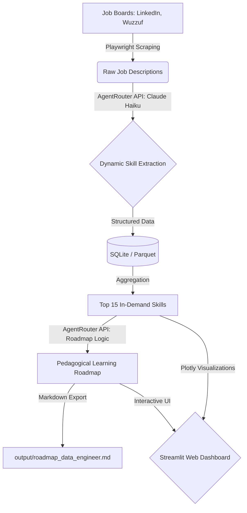

# Data & AI Career Roadmap Generator

[](https://www.python.org/)
[](https://playwright.dev/)
[](https://agentrouter.org/)
[](https://opensource.org/licenses/MIT)
[](https://streamlit.io/)

An end-to-end data engineering pipeline that scrapes real-time job market data, extracts technical skills using Claude AI (via AgentRouter), and powers an interactive Streamlit dashboard to generate sequential learning roadmaps bridging the gap between job seekers and market demand.

---

## System Architecture



---

## Key Features

- **Multi-Source Scraping**: Utilizes Playwright to navigate complex DOM structures of major job boards (LinkedIn, Wuzzuf).
- **AI-Powered Extraction**: Leverages `claude-haiku-4-5-20251001` through the AgentRouter API to identify technical tools and frameworks from unstructured text, avoiding brittle regex.
- **Smart Aggregation**: Ranks skills by frequency across different job profiles (Data Engineer, Analyst, ML Engineer, etc.).
- **Sequential Roadmaps**: Generates logical learning paths that explain *why* tools should be learned in a specific order (e.g., Python before Airflow).
- **Clean Data Storage**: Exports structured data to both high-performance **Parquet** files and queryable **SQLite** databases.
- **Interactive Web Dashboard**: Features a beautiful Streamlit application with Plotly charts for dynamic exploration of job market insights and 1-click roadmap generation.

---

## Project Structure

```text
roadmap_webscraping/
├── data/               # Persistent storage for scraped data (Parquet, SQLite)
├── docs/               # Detailed project documentation
├── scripts/            # Core Python pipeline components
│   ├── scraper_pipeline.py    # ETL: Extract, AI-Transform, Load
│   └── roadmap_generator.py   # Analysis & Roadmap Generation
├── app.py              # Streamlit Web Dashboard
├── output/             # Generated Markdown roadmaps
├── .gitignore          # Environment & data exclusions
├── LICENSE             # MIT License
├── requirements.txt    # Python dependencies
└── README.md           # Primary overview
```

---

## Documentation

For detailed instructions on how to set up and use the project, please refer to the documentation:

- [Setup Guide](docs/setup.md): Instructions for installation, dependencies, and API configuration.
- [Usage Guide](docs/usage.md): Step-by-step guide on running the pipelines.
- [Architecture Details](docs/architecture.md): Deep dive into the pipeline logic and design decisions.

---

## Technical Stack

- **Orchestration**: Python
- **Automation**: Playwright (Headless Chromium)
- **AI/LLM Integration**: AgentRouter API (`claude-haiku-4-5-20251001`)
- **Data Processing**: Pandas, PyArrow
- **Database**: SQLite3
- **Storage**: Apache Parquet
- **Web Frontend**: Streamlit
- **Data Visualization**: Plotly

---

## License
Distributed under the MIT License. See `LICENSE` for more information.
