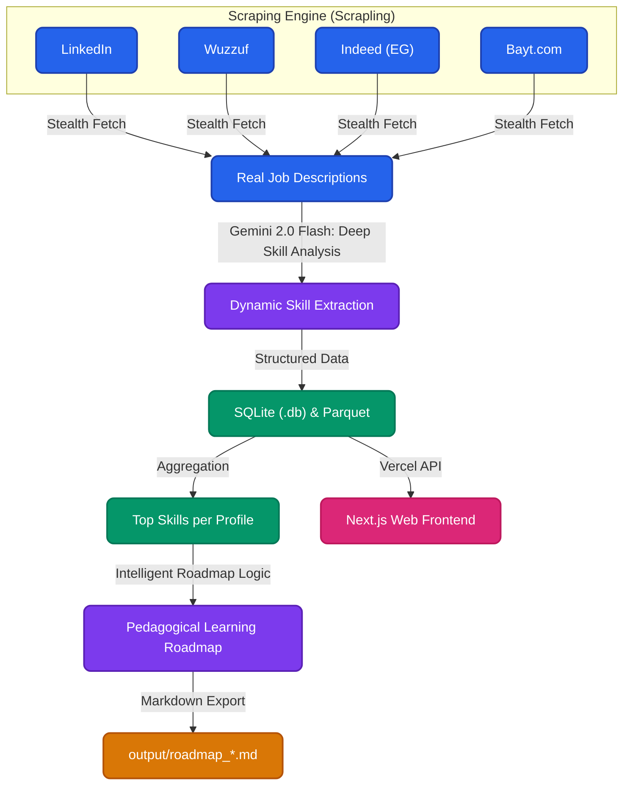

# Data & AI Career Roadmap Generator

[](https://www.python.org/)
[](https://github.com/D4Vinci/Scrapling)
[](https://aistudio.google.com/)
[](https://fastapi.tiangolo.com/)
[](https://nextjs.org/)
[](https://vercel.com/)
[](https://github.com/features/actions)
[](https://opensource.org/licenses/MIT)
[](CONTRIBUTING.md)

An end-to-end data engineering pipeline that scrapes real-time job market data across multiple platforms, extracts technical skills using Gemini 2.0 Flash, and powers an interactive Serverless Next.js web application to generate sequential learning roadmaps. Includes a GitHub Actions cron job for daily market data updates across 15+ job profiles.

---

## System Architecture



---

## Key Features

- **Multi-Source Aggregation**: Scrapes and merges data from **LinkedIn, Wuzzuf, Indeed, and Bayt.com** to provide a comprehensive view of the Middle East and global data markets.
- **15+ Specialized Profiles**: Tracks demand for roles from Data Analyst and BI Developer to MLOps, NLP, and Computer Vision Engineers.
- **Deep AI Analysis**: Leverages `gemini-2.0-flash` with context-aware prompts to extract not just keywords, but essential technical concepts and related technologies.
- **Intelligent Roadmaps**: Generates sequential learning paths that identify "missing links" (prerequisite tools) and explain the logical dependency between technologies (e.g., Python → Airflow).
- **Dual-Storage Engine**: Uses **SQLite** for complex relational queries and **Apache Parquet** for high-performance serverless reads.
- **Automated Daily Pipeline**: GitHub Actions orchestrates the entire ETL process every midnight, committing fresh data and keeping the live dashboard up-to-date.
- **Serverless API**: A unified FastAPI backend deployed as Vercel Functions, serving both pre-aggregated insights and real-time AI roadmap generation.
- **Modern Web Dashboard**: An interactive Next.js application featuring glassmorphism design, Recharts visualizations, and 1-click personalized roadmaps.

---

## Project Structure

```text
roadmap_webscraping/
├── .github/workflows/  # CI/CD Automation (Daily Scraper)
├── .env                # Local environment variables (API Keys)
├── data/               # Local data storage (SQLite & Parquet)
├── docs/               # Detailed documentation & setup guides
├── output/             # Generated Markdown roadmaps
├── web/                # Vercel Monorepo Root
│   ├── api/            # FastAPI Serverless Backend
│   │   ├── src/        # Scraper Pipeline & Roadmap Logic
│   │   ├── data/       # Production data files (committed by CI)
│   │   └── index.py    # API Lambda entry point
│   └── src/app/        # React Next.js Frontend
├── requirements.txt    # Base python dependencies
├── vercel.json         # Deployment & routing config
└── README.md           # This file
```

---

## Technical Stack

- **Orchestration**: GitHub Actions (Cron)
- **Scraping Engine**: Scrapling (Stealth Fetching, curl_cffi, browserforge)
- **AI/LLM**: Google GenAI SDK (`gemini-2.0-flash`)
- **Data Engineering**: Pandas, PyArrow, SQLite
- **Environment**: python-dotenv
- **Backend API**: FastAPI, Pydantic (Vercel Serverless)
- **Web Frontend**: Next.js (React), Vanilla CSS
- **Visualization**: Recharts
- **Hosting**: Vercel

---

## Documentation

- [Setup Guide](docs/setup.md): Installation, API configuration, and Environment setup.
- [Usage Guide](docs/usage.md): How to run the scraper and generator locally.
- [Architecture Details](docs/architecture.md): Deep dive into the extraction and roadmap logic.

---

## Contributing

Contributions are welcome! Please read the [CONTRIBUTING.md](CONTRIBUTING.md) for guidelines on reporting bugs or submitting pull requests.

---

## License
Distributed under the MIT License. See `LICENSE` for more information.
